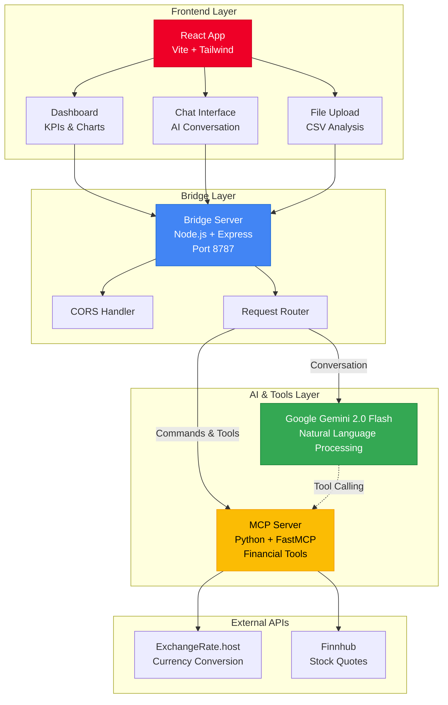
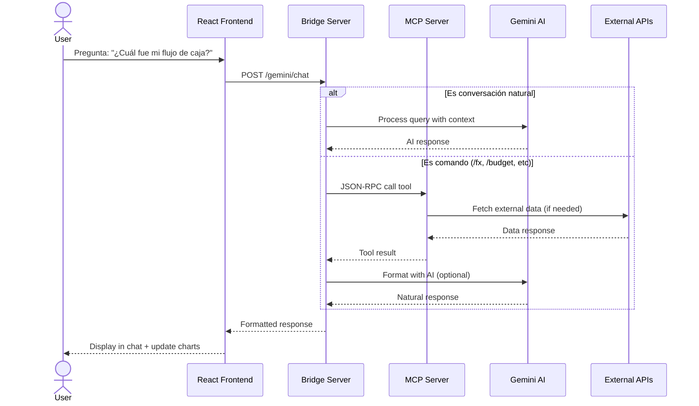
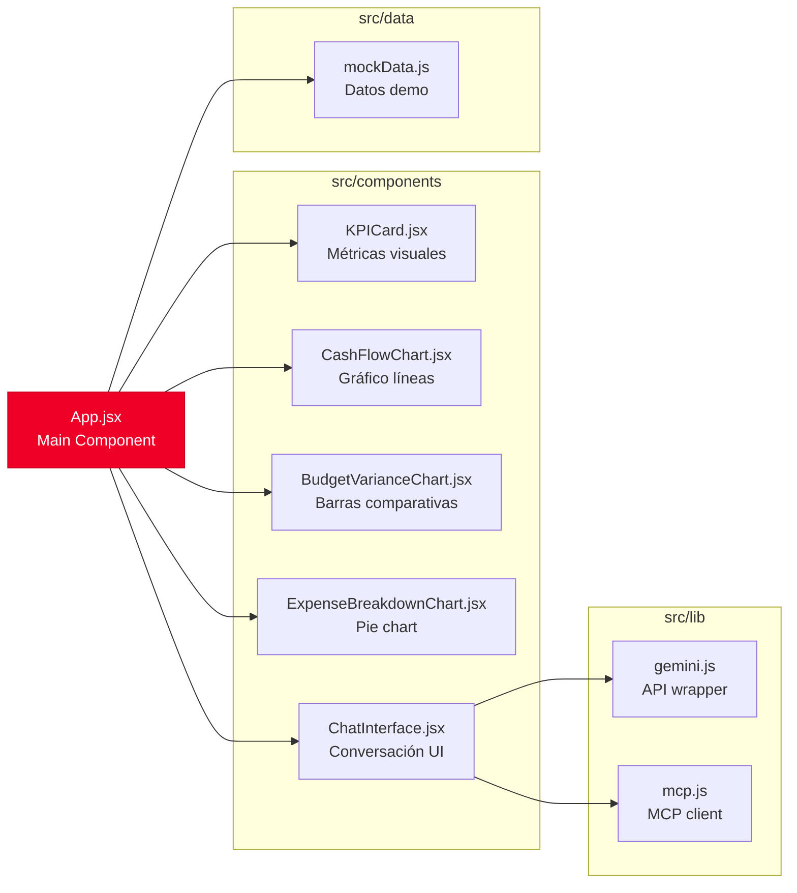
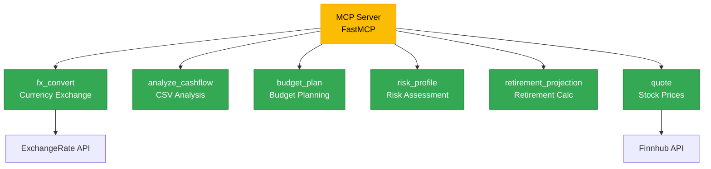
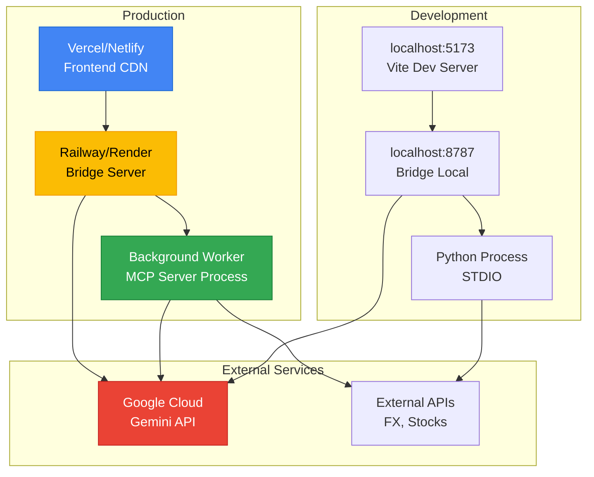
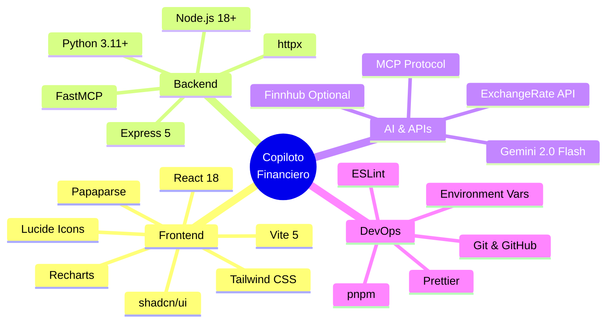
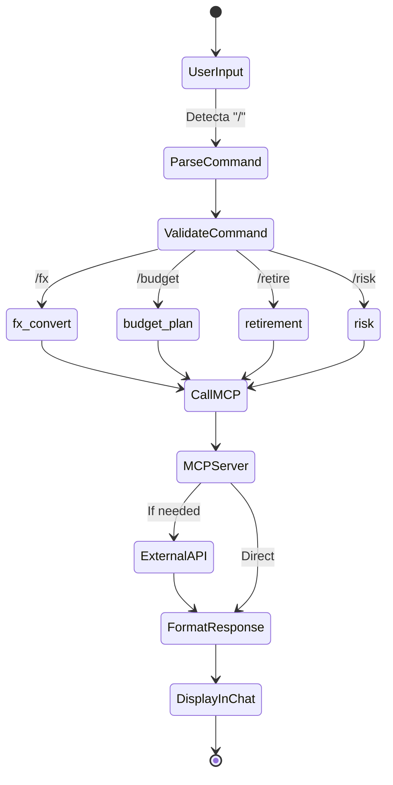
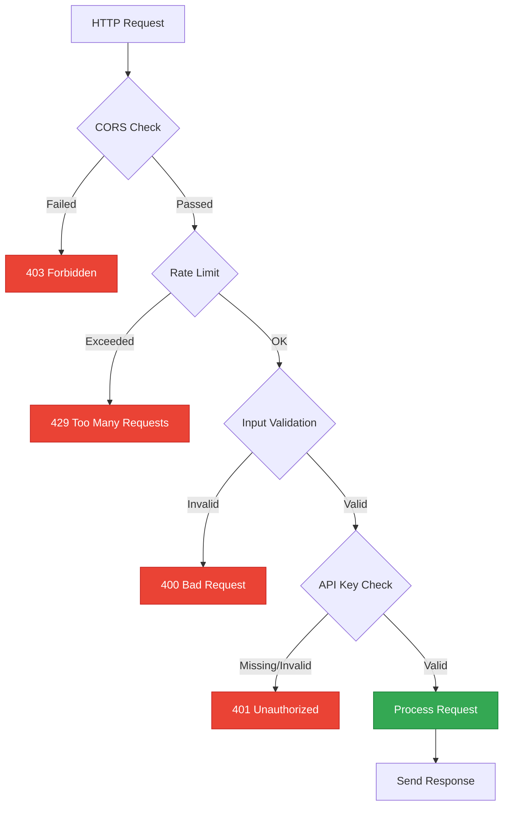

# Diagrama de Arquitectura - Copiloto Financiero Banorte

## Vista de Alto Nivel



## Flujo de Datos Detallado



## Arquitectura de Componentes



## MCP Tools Architecture



## Infraestructura de Deployment



## Tech Stack Completo



## Flujo de Slash Commands



## Seguridad y Validación



---

## Notas Técnicas

### Comunicación Frontend ↔ Bridge
- **Protocolo:** HTTP/REST
- **Puerto:** 8787 (configurable)
- **CORS:** Habilitado para desarrollo local
- **Rate Limiting:** Configurable (futuro)

### Comunicación Bridge ↔ MCP Server
- **Protocolo:** JSON-RPC sobre STDIO
- **Transporte:** LSP-style (Content-Length headers)
- **Fallback:** NDJSON line-delimited
- **Timeout:** 15 segundos por llamada

### Comunicación Bridge ↔ Gemini
- **SDK:** @google/genai v1.27.0
- **Modelo:** gemini-2.0-flash
- **API Version:** v1
- **Streaming:** No (por ahora)

### Estado y Persistencia
- **Frontend:** React useState (local)
- **Backend:** Stateless (cada request independiente)
- **Cache:** No implementado (futuro: Redis)
- **DB:** No hay (datos demo en memoria)

---

## Referencias

- [Model Context Protocol Spec](https://spec.modelcontextprotocol.io/)
- [Gemini API Docs](https://ai.google.dev/docs)
- [FastMCP Documentation](https://github.com/jlowin/fastmcp)
- [React 18 Docs](https://react.dev/)

---

**Para visualizar estos diagramas:**
1. Copia el contenido de los bloques ```mermaid```
2. Pégalo en [Mermaid Live Editor](https://mermaid.live/)